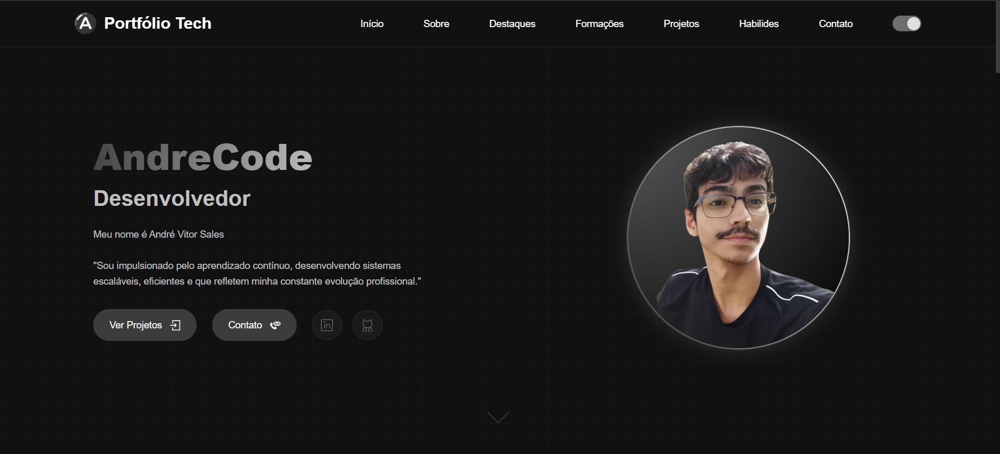

<h1 align="center">
  💻 Portfólio // André Vitor
</h1>

<h4 align="center"><a href="https://andrecode.dev.br/">Clique para visitar o projeto</a></h4>

## 📚 Seções

O site é composto por sete seções:

- **Home:** Nele temos uma breve apresentação;
- **Quem sou:** Nessa seção tenho uma descrição dizendo um pouco sobre quem sou;
- **Destaques:** Principais conquistas acadêmicas e profissionais ao longo da minha jornada;
- **Formações:** Cursos, formações acadêmicas e certificações conquistadas ao longo da minha trajetória;
- **Projetos:** Exibe através de cards os diferentes serviços em que possuo conhecimentos;
- **Habilidades:** Nele apresentamos meus conhecimentos em algumas linguagens e ferramentas;
- **Contato:** Nele apresento meus canais de comunicação para que você possa entrar em contato facilmente;

---

## 💼 Tecnologias utilizadas

Para o desenvolvimento deste site utilizei as seguintes tecnologias:

- HTML;
- CSS;
- JavaScript;
- BootStrap;

---

## Disponível para freelas - #OpenToWork 🚀

Atualmente estou aberto para oportunidades como Desenvolvedor Frontend e Backend. Se você precisa de alguém para transformar ideias em interfaces bonitas, responsivas e funcionais, podemos trabalhar juntos!

📬 Entre em contato:
📧 contato.andrecodedev@gmail.com
💼 [Linkedin](https://www.linkedin.com/in/andrecodedev/)